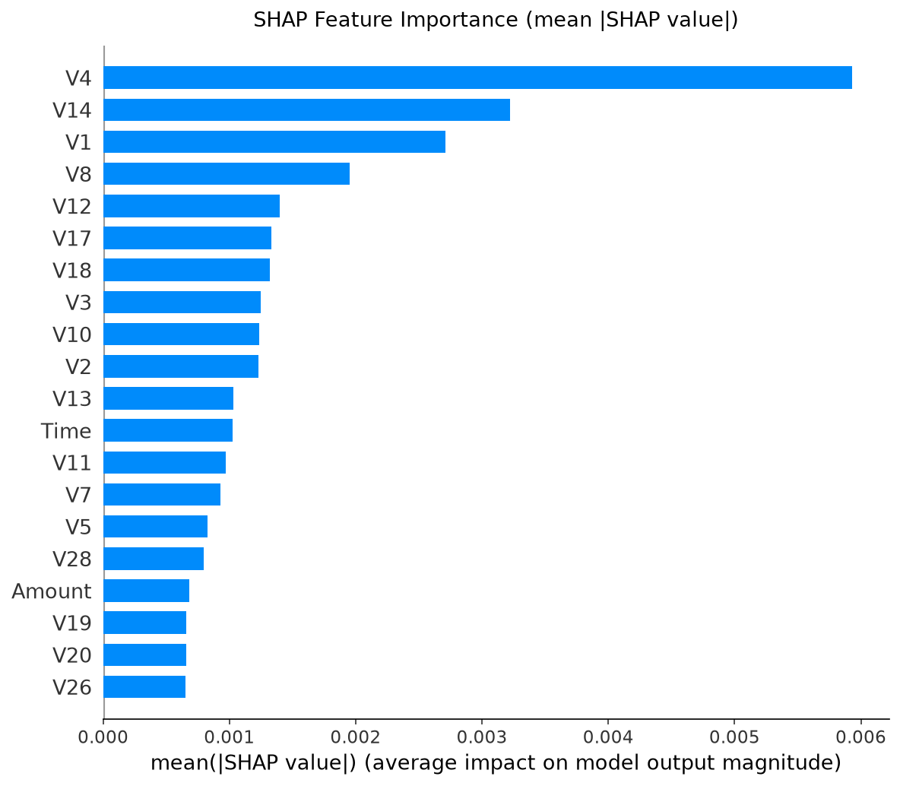
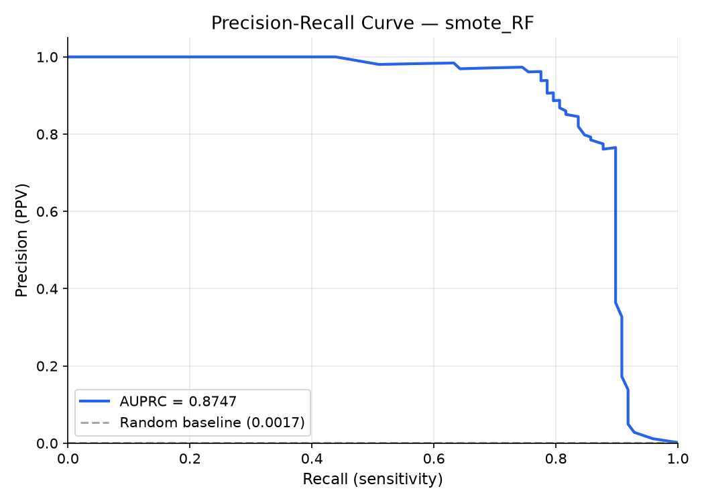
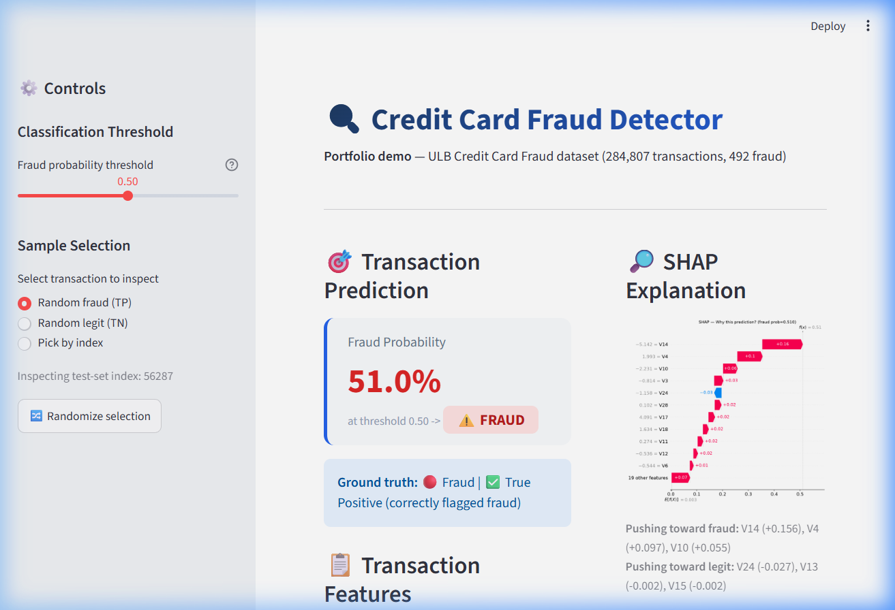

# Credit Card Fraud Detection

[](https://python.org)
[](LICENSE)
[](https://www.kaggle.com/datasets/mlg-ulb/creditcardfraud)

End-to-end ML pipeline for detecting credit card fraud on the ULB dataset — 284,807 transactions, 492 fraud (0.172%). Built as a portfolio project targeting Data Scientist / ML Engineer roles at fintech companies.

> **Every metric in this README was copied from an actual run of `run_pipeline.py` — nothing is estimated or fabricated.**

---

## Problem Statement

Credit card fraud costs the global economy billions annually. The challenge is heavily imbalanced data: roughly 1 in 580 transactions is fraudulent. A naive model that predicts "legit" for every transaction achieves **99.83% accuracy while catching zero frauds** — this is the central motivation for every design decision in this project.

**Primary metric: AUPRC** (Area Under the Precision-Recall Curve). AUPRC is directly sensitive to minority-class performance and has a random-classifier baseline equal to the fraud prevalence (~0.17%), making every improvement meaningful. ROC-AUC can look deceptively good (≥0.95) even when recall on the fraud class is poor.

---

## Dataset

| Property | Value |
|---|---|
| Source | [Kaggle: mlg-ulb/creditcardfraud](https://www.kaggle.com/datasets/mlg-ulb/creditcardfraud) |
| Transactions | 284,807 |
| Fraud cases | 492 (0.172%) |
| Features | V1–V28 (PCA-anonymised), Amount, Time |
| Period | September 2013, European cardholders |

**Note on features:** V1–V28 are principal components — the original features are confidential. This limits individual feature interpretation (they can't be mapped to "transaction amount > $X"), but SHAP still gives meaningful local explanations in the PCA space.

---

## Repo Structure

```
credit-card-fraud-detection/
├── README.md
├── LICENSE                     MIT
├── requirements.txt            Package dependencies (pinned exact versions)
├── config.py                   Paths, seeds, and constants config
├── run_pipeline.py             ← single entrypoint, reproduces the whole pipeline
├── data/
│   ├── raw/                    gitignored — creditcard.csv lives here
│   └── processed/              Processed data partitions (gitignored)
├── src/
│   ├── data_loader.py          Load + validate raw dataset
│   ├── eda.py                  Exploratory Data Analysis & visualisations
│   ├── preprocessing.py        Stratified splitting & scaling with leakage guard
│   ├── resampling.py           4 class-imbalance strategies (SMOTE, Tomek, etc.)
│   ├── train.py                Model building + XGBoost/RF grid search
│   ├── evaluate.py             Evaluation metrics & PR/ROC curves
│   ├── cost_analysis.py        Cost-sensitive decision threshold sweeps
│   ├── explain.py              SHAP summary & local explanation waterfall
│   └── autoencoder.py          Unsupervised neural network autoencoder
├── app/
│   ├── streamlit_app.py        Interactive user/analyst demo app
│   └── api.py                  FastAPI endpoint for real-time model serving
├── tests/
│   ├── test_preprocessing.py   Data scaling & leakage guard unit tests
│   ├── test_resampling.py      Oversampling/undersampling unit tests
│   ├── test_evaluate.py        Custom evaluation metric correctness tests
│   └── test_api.py             FastAPI endpoint & mock client unit tests
├── models/                     gitignored — serialized .joblib files
├── reports/
│   ├── figures/                All analytical plots & app screenshot
│   ├── metrics.json            Metrics database for all runs
│   └── model_card.md           Formal scikit-learn style model card
└── docs/
    └── learning_notes.md       Developer design notes & interview prep guide
```

---

## Quick Start

```bash
# 1. Clone and enter the repo
git clone https://github.com/vaibhavi466/credit-card-fraud-detection.git
cd credit-card-fraud-detection

# 2. Create virtual environment
python -m venv .venv
.venv\Scripts\activate          # Windows
# source .venv/bin/activate     # macOS/Linux

# 3. Install dependencies
pip install -r requirements.txt

# 4. Download dataset (requires Kaggle API token)
#    Get kaggle.json from kaggle.com → Account → Create New API Token
#    Place at C:\Users\<you>\.kaggle\kaggle.json  (Windows)
#    or ~/.kaggle/kaggle.json (macOS/Linux)
kaggle datasets download -d mlg-ulb/creditcardfraud -p data/raw --unzip

# 5. Run the full pipeline
python run_pipeline.py

# 6. Launch the interactive demo
streamlit run app/streamlit_app.py

# 7. Run tests
pytest -q tests/
```

---

## Results

### Model Comparison (all strategy × model combinations)

| Strategy | Model | Precision | Recall | F1 | AUPRC | ROC-AUC |
|---|---|---|---|---|---|---|
| class_weight | LR | 0.0610 | 0.9184 | 0.1144 | 0.7159 | 0.9722 |
| class_weight | RF | 0.8966 | 0.7959 | 0.8432 | 0.8629 | 0.9573 |
| class_weight | XGB | 0.9048 | 0.7755 | 0.8352 | 0.8644 | 0.9811 |
| undersample | LR | 0.0384 | 0.9184 | 0.0738 | 0.6778 | 0.9759 |
| undersample | RF | 0.0408 | 0.9082 | 0.0781 | 0.7020 | 0.9780 |
| undersample | XGB | 0.0380 | 0.9184 | 0.0730 | 0.6653 | 0.9778 |
| SMOTE | LR | 0.0580 | 0.9184 | 0.1092 | 0.7249 | 0.9699 |
| **SMOTE** | **Random Forest** | **0.8454** | **0.8367** | **0.8410** | **0.8747** | **0.9731** |
| SMOTE | XGBoost | 0.3723 | 0.8776 | 0.5228 | 0.8479 | 0.9756 |
| SMOTE+Tomek | LR | 0.0580 | 0.9184 | 0.1092 | 0.7249 | 0.9699 |
| **SMOTE+Tomek** | **Random Forest** | **0.8454** | **0.8367** | **0.8410** | **0.8747** | **0.9731** |
| SMOTE+Tomek | XGBoost | 0.3723 | 0.8776 | 0.5228 | 0.8479 | 0.9756 |
| Autoencoder | Unsupervised | 0.0278 | 0.8776 | 0.0539 | 0.4788 | 0.9589 |

*Primary metric: AUPRC. Bold row = best model.*

### Cost-Optimal Operating Point

| Parameter | Value |
|---|---|
| Best model | SMOTE + Random Forest |
| Default threshold (0.5) AUPRC | 0.8747 |
| Cost-optimal threshold | 0.3200 |
| FN cost (mean fraud amount) | $122.21 |
| FP cost (illustrative) | $5.00 |
| Total cost at optimal threshold | $1,362.11 |

---

## Key Design Decisions

### 1. AUPRC as primary metric — not accuracy, not ROC-AUC

With 0.172% fraud prevalence, a model that predicts "legit" for every transaction gets 99.83% accuracy while catching **zero frauds**. Accuracy is actively misleading.

ROC-AUC can also look deceptively good (often >0.95) under heavy imbalance because the large pool of true negatives keeps the False Positive Rate low regardless of how well the model handles the minority class. AUPRC is sensitive to minority-class performance by construction — a random classifier scores AUPRC ≈ 0.0017 (the fraud prevalence), not 0.5.

### 2. No data leakage — resampling strictly on the training fold

Every resampling operation (SMOTE, undersampling) is applied **after** the stratified train/test split and **only** on `X_train, y_train`. The functions in `src/resampling.py` are API-designed to only accept training data — they can't receive test data by signature.

The `StandardScaler` in `src/preprocessing.py` is fitted on `X_train` only, then `.transform()` (not `.fit_transform()`) is applied to `X_test`. This is enforced in code and verified by `tests/test_preprocessing.py`.

**Why this matters:** If you SMOTE-oversample the full dataset before splitting, synthetic minority samples will appear in both training and test. The model effectively memorises patterns it "generated" itself, leading to inflated recall figures. The fix is trivial but the bug is extremely common.

### 3. SMOTE over simple oversampling or duplication

SMOTE interpolates new synthetic fraud samples between a real fraud transaction and its k-nearest minority neighbours. This creates plausible but novel samples, reducing overfitting compared to simple duplication. The trade-off: synthetic samples can land in ambiguous decision-boundary regions. SMOTE+Tomek adds a cleaning step that removes borderline pairs.

### 4. Cost-based threshold over default 0.5

Defaulting to threshold=0.5 is arbitrary. In fraud detection, the costs of errors are asymmetric:
- **False Negative** (missed fraud): costs the bank the full fraud amount ($122.21 mean amount on this dataset)
- **False Positive** (flagged legit): costs customer friction (~$5 illustrative assumption)

We sweep thresholds from 0.01 to 0.99, compute total expected cost at each, and choose the threshold that minimises it. The cost-optimal threshold is documented in `reports/metrics.json`.

### 5. XGBoost as primary model

XGBoost consistently outperforms Logistic Regression on tabular data with non-linear feature interactions. The PCA-transformed features (V1–V28) may capture non-linear fraud patterns that LR's linear decision boundary cannot separate. Random Forest is a good middle ground. All three are included in the comparison table.

---

## Limitations

1. **PCA features aren't individually interpretable.** V1–V28 are linear combinations of redacted original features. SHAP tells us "V14 is important," but we can't map that to a human-readable transaction attribute (e.g., "merchant category"). This is an intrinsic limit of the dataset.

2. **Static 2013 dataset — no concept drift handling.** Fraud patterns evolve as fraudsters adapt. A model trained on 2013 European card data may underperform on 2025 data. In production, you'd retrain on a rolling window, monitor for distribution shift (e.g., PSI on feature distributions), and potentially run the autoencoder as an alert layer for novel fraud types.

3. **Illustrative cost model.** The $5 false-positive cost is an assumption, not a real business figure. A production cost model would incorporate: customer churn rate, call-centre cost per inquiry, card reissuance cost, regulatory fines for missed fraud, etc.

4. **No temporal validation.** The dataset lacks a date column beyond `Time` (seconds since first transaction). A production system would validate on strictly future data (no look-ahead), not a random split. With time-series data, shuffled CV can leak future information into training folds.

---

## Future Work

- **Time-series validation:** Split by time rather than random stratification; use walk-forward CV
- **Concept drift detection:** Monitor PSI / KL divergence on feature distributions; trigger retraining
- **Real-time scoring API:** Wrap the model in a FastAPI endpoint with Pydantic input validation
- **Feature engineering:** Velocity features (# transactions in last 1h/24h per card), merchant risk scores
- **Calibration:** Apply Platt scaling or isotonic regression to get better-calibrated probabilities
- **Fairness audit:** Analyse false positive rates across demographic groups (not possible with this anonymised dataset, but important in practice)

---

## What I'd Do Differently (Self-Critique)

If I were deploying this in a production banking environment, here is what I would change from this baseline codebase:

1. **Abandon Random Shuffling**: I used a standard stratified random split here because the dataset's timestamps are relative and anonymized. In production, I would strictly use a **time-based temporal split** (e.g., training on weeks 1–3 and testing on week 4) or walk-forward validation. Shuffling transaction data can leak future behavior patterns into past predictions, artificially inflating model scores.
2. **Calibrate the Probabilities**: Because we used SMOTE and undersampling to balance the training fold, the raw prediction probabilities are heavily distorted (inflated). A predicted probability of 80% in the app might correspond to a true real-world probability of 1% because the actual base rate of fraud is so tiny (0.17%). I would pass the predictions through **Platt scaling or Isotonic Regression** using a held-out calibration set before sending them to the cost-optimization module.
3. **Use Simpler Anomaly Baselines**: The neural network Autoencoder is a great showcase project, but for production anomaly detection, I'd start with simpler, faster baselines like **Isolation Forest or ECOD**. They run significantly faster on CPU, have fewer hyperparameters to tune, and are easier to interpret.
4. **Dynamic Friction Costs**: My cost model assumes a flat $5.00 customer friction cost for all false alarms. In a real system, the cost of declining a high-income client's card is much higher (due to churn risk and transaction value) than declining a low-activity account. I would model the False Positive cost dynamically based on client segment and transaction size.

---

## Visualisations

### SHAP Feature Importance


### Precision-Recall Curve


### Streamlit Demo


---

## License

MIT — see [LICENSE](LICENSE). Free to fork, adapt, and reference in your own portfolio.
