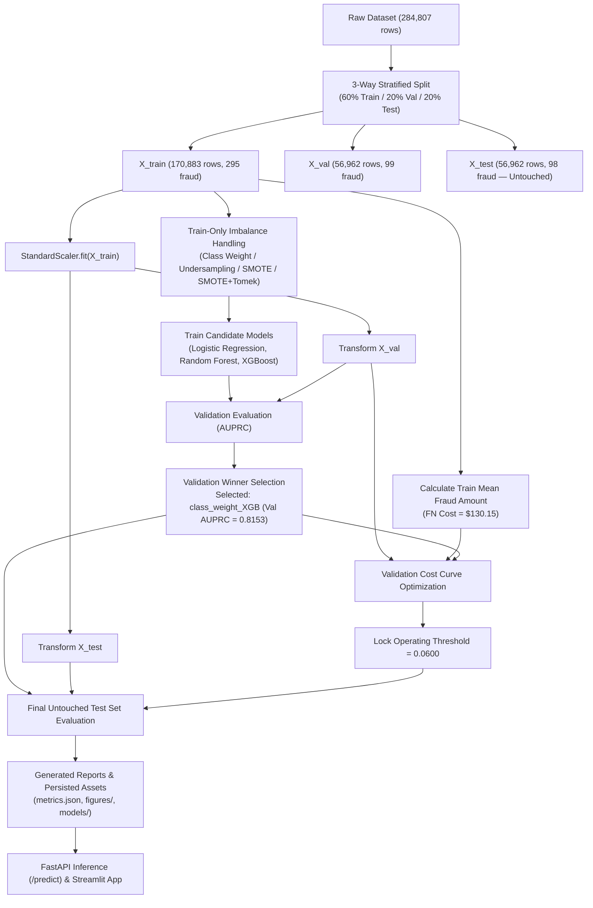

# Credit Card Fraud Detection

[](https://python.org)
[](LICENSE)
[](https://www.kaggle.com/datasets/mlg-ulb/creditcardfraud)

End-to-end Machine Learning pipeline for detecting credit card fraud on the ULB dataset — 284,807 transactions, 492 fraud (0.172%). Built as a portfolio project targeting Data Scientist / ML Engineer roles at fintech companies.

> **Every metric in this README was generated from an actual execution of `run_pipeline.py` — nothing is estimated, hardcoded, or fabricated.**

---

## Problem Statement

Credit card fraud costs the global financial system billions annually. The central technical challenge is severe class imbalance: roughly 1 in 580 transactions is fraudulent (0.172%). A naive classifier predicting "legitimate" for every transaction achieves **99.83% accuracy while missing 100% of fraud cases** — rendering standard accuracy useless.

**Primary evaluation metric: AUPRC** (Area Under the Precision-Recall Curve). AUPRC is directly sensitive to minority-class performance and has a random-classifier baseline equal to the fraud prevalence (~0.172%), making every improvement mathematically defensible. ROC-AUC can look deceptively high (≥0.95) even when minority recall is poor due to the large pool of true negatives.

---

## Dataset

| Property | Value |
|---|---|
| Source | [Kaggle: mlg-ulb/creditcardfraud](https://www.kaggle.com/datasets/mlg-ulb/creditcardfraud) |
| Transactions | 284,807 |
| Fraud cases | 492 (0.1727%) |
| Legitimate cases | 284,315 (99.8273%) |
| Features | V1–V28 (PCA-transformed/anonymised), Amount, Time |
| Period | September 2013, European cardholders |

**Feature note:** V1–V28 are PCA-transformed/anonymised features. This project scales the raw `Amount` and `Time` features using training statistics while preserving the provided PCA components.

---

## Pipeline Architecture



---

## Repository Structure

```
credit-card-fraud-detection/
├── README.md
├── LICENSE                     MIT License
├── requirements.txt            Package dependencies (pinned exact versions)
├── config.py                   Paths, seeds, and system constants
├── run_pipeline.py             ← Entrypoint reproducing the full pipeline end-to-end
├── data/
│   ├── raw/                    creditcard.csv (gitignored)
│   └── processed/              Processed data partitions (gitignored)
├── src/
│   ├── data_loader.py          Dataset loading and schema verification
│   ├── eda.py                  Exploratory Data Analysis and figures
│   ├── preprocessing.py        3-way stratified split and train-fitted StandardScaler
│   ├── resampling.py           Train-only resampling (Class Weight, Undersampling, SMOTE, SMOTE+Tomek)
│   ├── train.py                Model training and imblearn cross-validation tuning
│   ├── evaluate.py             Metric generation and curve plotting
│   ├── cost_analysis.py        Train-derived FN cost calculation and validation threshold optimization
│   ├── explain.py              SHAP summary, beeswarm, and waterfall explainability
│   └── autoencoder.py          Unsupervised neural network autoencoder (MLPRegressor)
├── app/
│   ├── streamlit_app.py        Interactive analytical dashboard
│   └── api.py                  FastAPI REST endpoint (/health, /predict)
├── tests/
│   ├── test_preprocessing.py   3-way split, non-overlap, and scaling leakage guard tests
│   ├── test_resampling.py      Resampling shape and fold isolation tests
│   ├── test_evaluate.py        Custom evaluation metric correctness tests
│   ├── test_api.py             FastAPI request validation and threshold tests
│   └── test_pipeline_correctness.py Pipeline orchestration and methodology tests
├── models/                     gitignored — serialized model, scaler, and metadata (.joblib)
├── reports/
│   ├── figures/                Analytical visualizations
│   ├── metrics.json            Structured metrics store for all runs
│   └── model_card.md           Formal scikit-learn style model card
└── docs/
    └── learning_notes.md       Technical reference and interview defensibility guide
```

---

## Quick Start

```bash
# 1. Clone the repository
git clone https://github.com/vaibhavi466/credit-card-fraud-detection.git
cd credit-card-fraud-detection

# 2. Create and activate virtual environment
python -m venv .venv
.venv\Scripts\activate          # Windows
# source .venv/bin/activate     # macOS/Linux

# 3. Install pinned dependencies
pip install -r requirements.txt

# 4. Download dataset (requires Kaggle API key)
kaggle datasets download -d mlg-ulb/creditcardfraud -p data/raw --unzip

# 5. Run the complete pipeline end-to-end
python run_pipeline.py

# 6. Launch the FastAPI server
uvicorn app.api:app --reload

# 7. Launch the Streamlit application
streamlit run app/streamlit_app.py

# 8. Run unit test suite
pytest -q tests/
```

---

## Results

### 1. Validation Candidate Selection (60% Train / 20% Validation)

Candidate models were trained on `X_train` (with resampling applied strictly to `X_train`) and evaluated on `X_val` at default threshold 0.50 to select the winning strategy and model family based on **Validation AUPRC**:

| Strategy | Model | Precision | Recall | F1 | Val AUPRC | ROC-AUC | Status |
|---|---|---|---|---|---|---|---|
| class_weight | Logistic Regression | 0.0591 | 0.8990 | 0.1108 | 0.6831 | 0.9747 | Evaluated |
| class_weight | Random Forest | 0.8889 | 0.7273 | 0.8000 | 0.7985 | 0.9466 | Evaluated |
| **class_weight** | **XGBoost** | **0.9351** | **0.7273** | **0.8182** | **0.8153** | **0.9737** | **Selected Winner** |
| undersample | Logistic Regression | 0.0363 | 0.8990 | 0.0698 | 0.4864 | 0.9720 | Evaluated |
| undersample | Random Forest | 0.0508 | 0.8687 | 0.0959 | 0.6989 | 0.9739 | Evaluated |
| undersample | XGBoost | 0.0438 | 0.8889 | 0.0834 | 0.6118 | 0.9746 | Evaluated |
| SMOTE | Logistic Regression | 0.0568 | 0.8788 | 0.1067 | 0.6737 | 0.9716 | Evaluated |
| SMOTE | Random Forest | 0.8736 | 0.7677 | 0.8172 | 0.8019 | 0.9717 | Evaluated |
| SMOTE | XGBoost | 0.4483 | 0.7879 | 0.5714 | 0.7821 | 0.9727 | Evaluated |
| SMOTE+Tomek | Logistic Regression | 0.0568 | 0.8788 | 0.1067 | 0.6737 | 0.9716 | Evaluated |
| SMOTE+Tomek | Random Forest | 0.8736 | 0.7677 | 0.8172 | 0.8019 | 0.9717 | Evaluated |
| SMOTE+Tomek | XGBoost | 0.4483 | 0.7879 | 0.5714 | 0.7821 | 0.9727 | Evaluated |

*Primary selection metric: Validation AUPRC. Bold row indicates candidate selected for locked evaluation.*

### 2. Validation-Selected Operating Threshold & Cost Analysis

Threshold optimization was performed strictly on validation predictions using train-derived cost parameters:

| Parameter | Value | Derivation |
|---|---|---|
| Train Mean Fraud Amount (FN Cost) | $130.15 | Mean `Amount` of fraud cases in `X_train` |
| Illustrative Friction Cost (FP Cost) | $5.00 | Documented friction assumption |
| Validation Optimal Threshold | **0.0600** | Minimizes total cost on `X_val` |
| Validation Total Cost | $2,677.91 | 20 FN + 15 FP |

### 3. Final Evaluation on Untouched Test Set (20% Test, 56,962 samples, 98 fraud)

The winning candidate (`class_weight_XGB`) and locked threshold (0.0600) were evaluated exactly once on the final untouched test set:

| Evaluation Setting | Operating Threshold | Precision | Recall | F1 | Test AUPRC | Test ROC-AUC | TP | FP | TN | FN |
|---|---|---|---|---|---|---|---|---|---|---|
| Standard Reference | 0.5000 | 0.9398 | 0.7959 | 0.8619 | 0.8771 | 0.9764 | 78 | 5 | 56,859 | 20 |
| **Validation-Locked** | **0.0600** | **0.8019** | **0.8673** | **0.8333** | **0.8771** | **0.9764** | **85** | **21** | **56,843** | **13** |

*Unsupervised Autoencoder baseline on test set:* Test AUPRC = 0.4338, Recall = 0.8673, Precision = 0.0281.

---

## Methodological Rigor & Technical Defensibility

1. **Strict 3-Way Stratified Partitioning:** The dataset is split into 60% Train, 20% Validation, and 20% Final Test. The final test set is locked until after model selection and threshold tuning.
2. **Scaler Fit Isolation:** `StandardScaler` is fitted **exclusively** on `X_train` (`Amount` and `Time`). Validation and test features are transformed using training means (`Amount`: $87.63, `Time`: 94,864.79s) and standard deviations (`Amount`: $243.80, `Time`: 47,459.08s).
3. **Resampling Fold Isolation:** Oversampling (SMOTE) and undersampling operate strictly on training data. For hyperparameter search (`--tune`), `imblearn.pipeline.Pipeline` executes resampling independently within each cross-validation fold to prevent data leakage.
4. **Validation-Only Cost Tuning:** False-Negative costs ($130.15) are calculated strictly from training row indices. The operating threshold (0.0600) is selected via validation cost minimization and locked prior to test set evaluation.
5. **Autoencoder Validation Isolation:** The unsupervised autoencoder (`MLPRegressor`) is trained strictly on legitimate `X_train` transactions. Its reconstruction error decision threshold (0.5168) is set at the 95th percentile of `X_val` legitimate errors before final test scoring.

---

## Model Serving & Applications

### 1. FastAPI REST API (`app/api.py`)
Provides production-compatible inference endpoints loading the persisted scaler, winning model, and locked threshold:
- `GET /health`: Returns service health status and model metadata.
- `POST /predict`: Accepts a transaction feature vector and optional custom threshold, returning `fraud_prediction`, `fraud_score`, `operating_threshold`, and `risk_level`.

### 2. Streamlit Analytical Dashboard (`app/streamlit_app.py`)
Interactive application for fraud analysts featuring:
- **Transaction Inspection:** Select real test transactions or create custom vectors.
- **Dynamic Threshold Control:** Adjust operating thresholds while monitoring risk scores.
- **SHAP Explanation:** Real-time visual explanation of feature contributions.

---

## Limitations

1. **PCA Feature Redaction:** Features V1–V28 are anonymised principal components. Feature contributions (e.g. V4, V14, V12) represent mathematical components rather than raw merchant categories or customer IDs.
2. **Synthetic Random Splitting vs. Temporal Validation:** The dataset uses relative timestamps (`Time` in seconds) without full calendar timestamps. A production system would employ strict time-based temporal splitting to handle macro trend shifts.
3. **Illustrative Cost Model:** The $5 FP cost is an illustrative assumption. Production deployments should parameterize FP costs dynamically based on customer lifetime value and transaction amounts.
4. **Uncalibrated Probability Scores:** Raw model outputs reflect non-linear ensemble confidence scores rather than calibrated true posterior probabilities.

---

## License

This project is licensed under the MIT License — see [LICENSE](LICENSE) for details.
